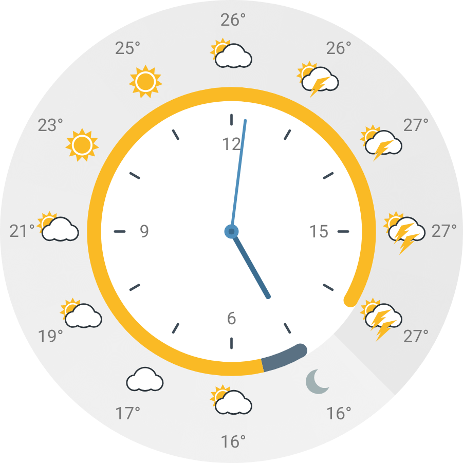

## WeatherWatch

### What is WeatherWatch?

WeatherWatch is a web application that displays weather forecast information in an analog clock face format.
The front-end is implemented with React.js and the application state is implemented with Redux.

The weather forecast data is obtained from WeatherWatchServer, of which implementation can be found at https://github.com/lonssi/WeatherWatchServer

The weather icons are originally from https://github.com/fmidev/opendata-resources/tree/master/symbols. A night version for each icon has been created and some small tweaks have been applied to achieve better symmetry.

WeatherWatch is running at https://weatherwatch.tech

### Requirements

The following are required to run the project:

- `docker`
- `docker-compose`

### Getting started

To start the development environment run the `run-dev-environment.sh` script.
The application can be accessed in http://localhost:3000/.

To start the production environment run the `run-prod-environment.sh` script.
The application is served to port `5000`.

### License

This project is distributed under the [MIT License](http://opensource.org/licenses/MIT).
